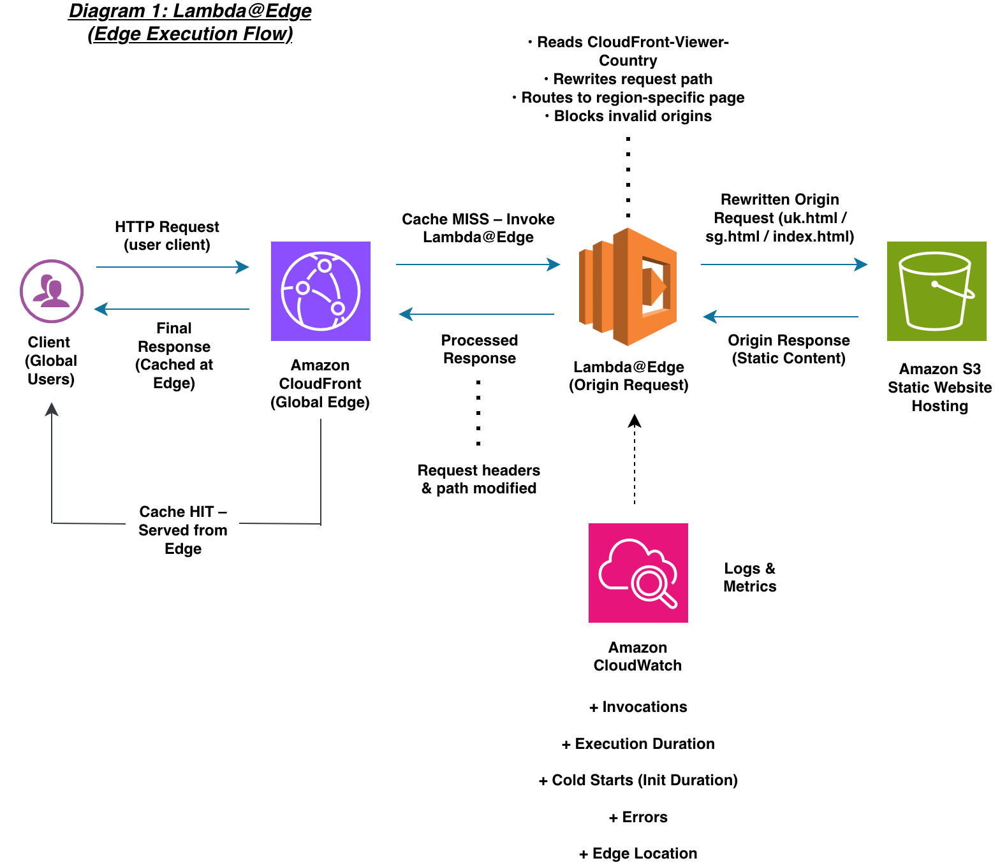
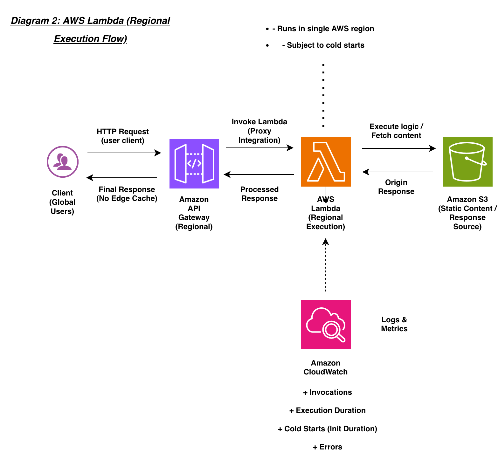

# AWS Lambda vs Lambda@Edge: Edge Computing Performance Analysis

## Overview

This project evaluates the performance differences between AWS Lambda (regional execution) and Lambda@Edge (global edge execution) using a realistic scenario:
personalising a static website based on the user’s geographic location.

The goal is to understand how identical serverless logic behaves when executed:

Centrally in a single AWS region (API Gateway → Lambda)

Distributed globally across CloudFront edge locations (Lambda@Edge)

The study focuses on:

+ Latency

+ Cold starts

+ Geographic performance

+ Cache behaviour

+ Scalability under load

## Key Features

+ Geo-personalised static website served via CloudFront

⚡ Lambda@Edge rewrites requests based on user country

+ Regional Lambda used as a baseline for comparison

+ Rigorous, research-backed testing methodology

+ Statistical performance analysis (variance, medians, percentiles)

+ Global testing using VPNs to simulate remote users

## Architecture

### 1. Lambda@Edge – Edge Execution

User → CloudFront → Lambda@Edge → S3 Static Website → Response

Reads the CloudFront-Viewer-Country header  
Rewrites the request to region-specific content:

🇬🇧 UK → uk.html  
🇸🇬 Singapore → sg.html  
🌐 Default → index.html  

CloudFront caching accelerates repeated requests

### 2. Regional Lambda – Baseline Execution

User → API Gateway → Regional Lambda → Response

Implements the same geo-routing logic  
Provides a centralised comparison baseline  
Exhibits typical cold starts and regional latency

## Tools & Technologies

[AWS Lambda – regional execution](https://aws.amazon.com/lambda/)  

[Lambda@Edge – edge execution](https://docs.aws.amazon.com/AmazonCloudFront/latest/DeveloperGuide/lambda-at-the-edge.html)  

[Amazon CloudFront – CDN + edge compute](https://aws.amazon.com/cloudfront/)  

[Amazon S3 – static website hosting](https://aws.amazon.com/s3/)  

[Amazon API Gateway – regional API entry](https://aws.amazon.com/api-gateway/)  

[Amazon CloudWatch – monitoring & metrics](https://aws.amazon.com/cloudwatch/) 

[Postman – latency and load simulation](https://www.postman.com/)  

[VPNs – simulate global users (with routing limitations)](https://nordvpn.com/)  

[Python – Lambda function development](https://www.python.org/)  

[GitHub – documentation and code management](https://github.com/)  

## Testing Methodology

Designed to be robust, repeatable, and academically rigorous.

## 1. Baseline Latency Comparison

Compare Lambda@Edge vs Regional Lambda

Use VPNs to simulate UK, EU, US, and Asia

Repeat each test 30 times across 3 cycles

Measure:

Total latency

Lambda execution duration

CloudFront edge location

Compute:

Mean

Median

Standard deviation

Coefficient of variation

⚠️ Note: VPN routing can introduce additional hops and noise, but still provides useful trend comparisons.

## 2. Cache Behaviour (HIT vs MISS)

Force cache miss:

Cache-Control: no-cache

Measure:

First-request MISS latency

Repeated-request HIT latency

CloudFront caching consistency & performance

## 3. Cold Start Analysis

Let functions idle for ~45 minutes.

Capture:

Init duration (cold start)

Execution duration

Warm vs cold differences

Compare regional cold-start severity vs edge

## 4. Concurrency & Scalability Testing

Simulate concurrent users:

1

10

50

100

Collect:

P50 latency

P90 latency

P99 latency

Error rates / throttling

## 5. Payload Size Variation

Test HTML files of different sizes:

Small (~3 KB)

Medium (~30 KB)

Large (~300 KB with assets)

Measure:

TTFB (Time To First Byte)

Total download time

Latency differences between region vs edge

## 6. Geographic Performance Evaluation

Use VPNs to simulate long-distance user requests

Acknowledge limitations:

Extra routing layers

VPN server inconsistencies

Focus on latency trend differences, not absolute precision

Compare:

Lambda@Edge latency vs

Regional Lambda latency over distance

Expected Outcomes
Lambda@Edge is expected to:

Significantly reduce latency for global users

Deliver much faster repeated responses due to caching

Provide more stable performance under load

Regional Lambda is expected to:

Show increased latency for distant users

Exhibit more pronounced cold starts

Be less efficient for globally distributed workloads

## References 

[References](https://github.com/HamzaHassan21/lambda-vs-lambdaedge-performance-analysis/blob/main/References.md)

## Author Hamza Hassan - Final-Year Computer Science Student, Cloud & DevOps Enthusiast

## 📫 Connect with Me
[LinkedIn](https://www.linkedin.com/in/hamzahassan21/)
[Youtube](https://www.youtube.com/channel/UC51JEAEBV8WXwf2ZLROvUJw)

