# AWS Lambda vs Lambda@Edge: Architectural and Performance Evaluation
## A Controlled Performance Evaluation of Centralised vs Edge-Based Serverless Architectures

---

## 📌 Overview

This project presents a controlled experimental evaluation of two serverless architectures:

- Centralised AWS Lambda (Regional Execution)
- Distributed Lambda@Edge (Edge Execution via CloudFront)

The goal is to critically assess when edge computing actually improves performance, rather than assuming it is always superior.

Unlike many benchmarks, this project ensures fair comparison conditions by:

- Serving identical content from a shared S3 origin
- Using deterministic routing (`?country=XX`) instead of IP-based geolocation
- Isolating key variables such as caching, cold starts, and geographic distance

📄 **Final Dissertation:** [View Report](./FYP_FINAL.pdf)

---

## 🎯 Key Objectives

- Compare latency and responsiveness between architectures
- Analyse cold start vs warm execution behaviour
- Evaluate CloudFront caching impact (HIT vs MISS)
- Measure geographic latency effects (global + UK local tests)
- Assess performance stability under repeated requests
- Identify real-world trade-offs: performance vs complexity vs observability

---

## 🏗️ Architecture

### 1. Lambda@Edge (Distributed Edge Architecture)

#### Execution Flow

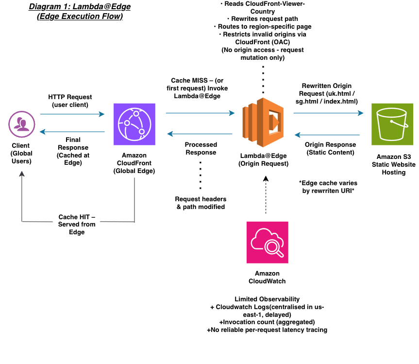

**Flow:**  
User → CloudFront → Lambda@Edge (Viewer Request) → S3 Static Content → Response

- Lambda@Edge executes at the viewer-request phase, before CloudFront’s cache decision
- The function reads the `CloudFront-Viewer-Country` header (or a controlled query-string override during testing)
- The request URI is rewritten to region-specific content, for example:
  - 🇬🇧 GB → `uk.html`
  - 🇺🇸 US → `us.html`
  - 🇸🇬 SG → `sg.html`
  - 🇦🇺 AU → `au.html`
  - 🌐 Default → `index.html`
- Lambda@Edge does not access S3 directly; it performs request mutation only
- CloudFront caching operates on the rewritten URI, allowing region-specific content to be cached independently at the edge
- The S3 bucket remains private and is accessible only through CloudFront using OAC

### 2. Regional AWS Lambda – Baseline Architecture

#### Execution Flow

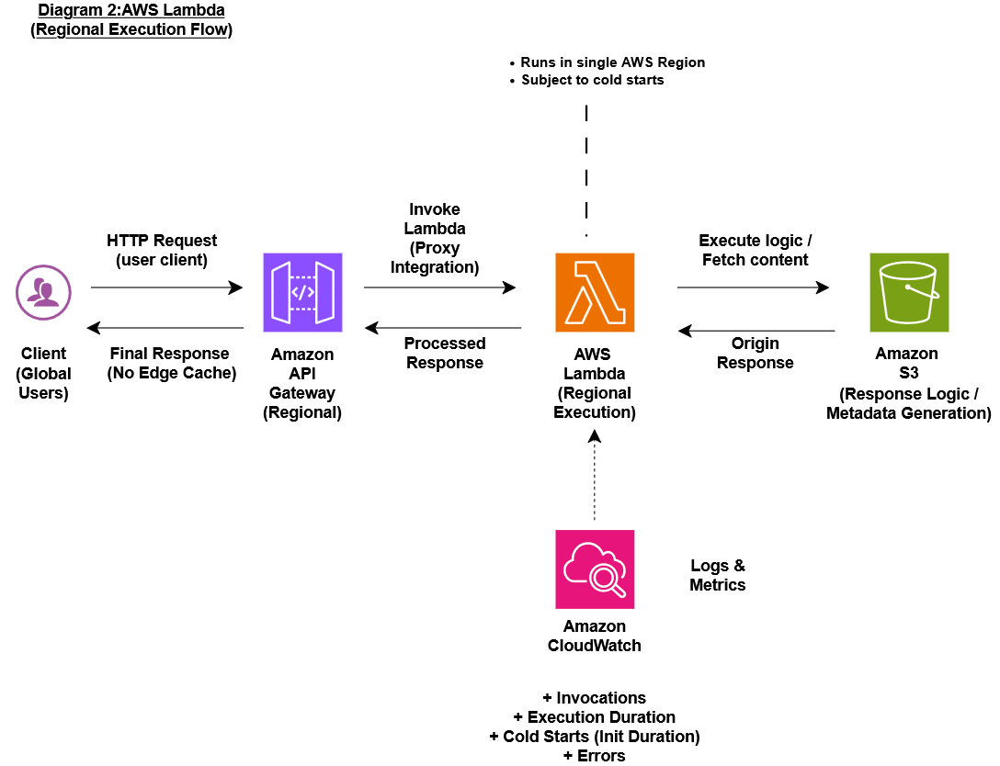

**Flow:**  
User → API Gateway → Regional AWS Lambda → Response

- Single-region execution (`eu-west-2`)
- No CDN caching
- Full observability via CloudWatch

This architecture provides a measurable and observable baseline against which Lambda@Edge behaviour is evaluated.

**Key Insight:**

- Provides better debugging and visibility
- Suffers from geographic latency and cold starts

### Regional Lambda – Observability Evidence

The screenshot below shows CloudWatch execution logs for the regional AWS Lambda baseline.

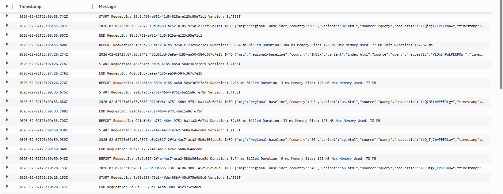

**Key observations:**

- Full visibility into execution duration and init duration
- Clear cold start detection
- Per-request logging of routing decisions
- Supports detailed latency and variability analysis

This level of observability is not available for Lambda@Edge, forming part of the architectural trade-off evaluated in this project.

---

## ⚙️ Tools & Technologies

- [AWS Lambda – regional execution](https://aws.amazon.com/lambda/)
- [Lambda@Edge – edge execution](https://docs.aws.amazon.com/AmazonCloudFront/latest/DeveloperGuide/lambda-at-the-edge.html)
- [Amazon CloudFront – CDN and edge compute](https://aws.amazon.com/cloudfront/)
- [Amazon S3 – static website hosting](https://aws.amazon.com/s3/)
- [Amazon API Gateway – regional API entry point](https://aws.amazon.com/api-gateway/)
- [Amazon CloudWatch – monitoring & metrics](https://aws.amazon.com/cloudwatch/)
- [Postman – repeatable latency and concurrency testing](https://www.postman.com/)
- [curl – protocol-level timing and header inspection](https://www.curl.com/)
- [GitHub – documentation and code management](https://github.com/)

---

## 🧪 Testing Methodology

The testing methodology is designed to be controlled, repeatable, and academically defensible.

### 1. Cold Start vs Warm Execution

This experiment evaluates the impact of execution environment initialisation on latency.

- Functions were left idle for extended periods to trigger cold starts
- Initial request latency was compared against subsequent invocations

**Observed Results (Regional Lambda):**

- Cold Start: ~1780 ms
- Warm Execution: ~80 ms
- Difference: ~20× increase

**Interpretation:**

- Cold starts introduce significant latency overhead, primarily due to:
  - Container provisioning
  - Runtime initialisation
- Warm executions demonstrate stable, low-latency behaviour, representing steady-state performance

This highlights that average latency alone is misleading unless execution state (cold vs warm) is considered.

#### Regional Lambda Cold Start Response

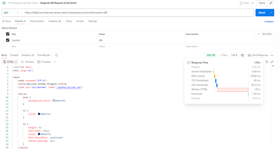

#### Regional Lambda Warm Execution Summary

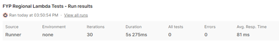

#### Regional Lambda Warm Execution Detailed Iterations


#### Cold vs Warm Comparison

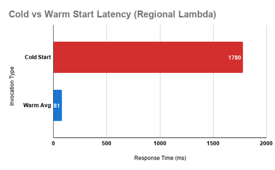

#### CloudWatch Logs Showing Cold Start


---

### 2. Cache Behaviour Analysis (Lambda@Edge + CloudFront)

This experiment isolates the impact of CDN caching, a critical factor in edge performance.

**Method:**

- Cache MISS enforced using unique query parameters (`cachebust`)
- Cache HIT measured using repeated identical requests

**Observed Behaviour:**

- Cache MISS: ~100–500+ ms
- Cache HIT: ~20–50 ms

**Key Observations:**

- First request incurs:
  - Origin fetch (S3)
  - Full network traversal
- Subsequent requests are served directly from edge cache

**Interpretation:**

- Performance improvements in Lambda@Edge are primarily driven by caching, not just execution location
- Cache HIT scenarios show:
  - Lower latency
  - Higher consistency
- Cache MISS scenarios behave closer to traditional architectures

This demonstrates that cache efficiency is the dominant factor in edge performance.

#### Cache MISS Responses

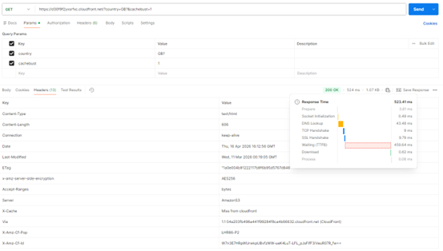
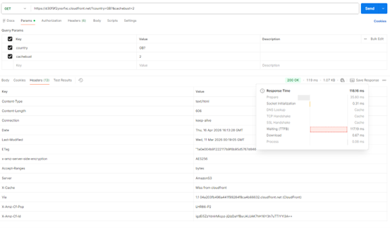

#### Cache HIT Responses


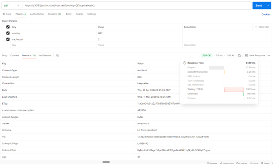

#### Cache HIT Consistency


#### Cache Performance Graph

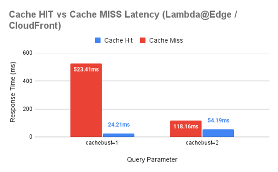

---

### 3. Geographic Latency Testing

This experiment evaluates how physical distance from the compute region affects performance.

**Method:**

- VPN-based simulation across:
  - 🇬🇧 United Kingdom (baseline)
  - 🇺🇸 United States
  - 🇸🇬 Singapore
  - 🇦🇺 Australia
- Additional local UK testing:
  - London
  - Manchester
  - Edinburgh

**Observed Results:**

- Regional Lambda latency increases significantly with distance
- Lambda@Edge maintains relatively consistent performance globally

**Example:**

- US → Regional: ~1290 ms
- US → Edge: ~182 ms

**Interpretation:**

- Centralised architectures suffer from:
  - Increased round-trip time
  - Network propagation delays
- Edge architecture reduces latency by:
  - Serving requests from nearest edge location
  - Leveraging cached content

Edge computing is most beneficial for globally distributed users.

#### United Kingdom (London)


#### United States


#### Singapore


#### Australia


#### Geographic Comparison Graph


#### Localised UK Testing


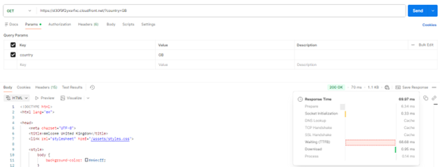

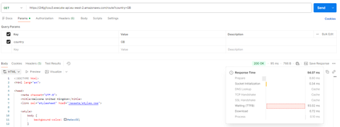
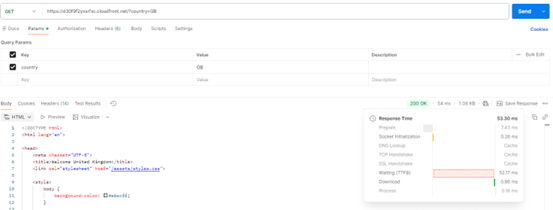

---

### 4. Repeated Request Performance (100 Iterations)

This experiment evaluates performance stability and variability under sustained usage.

**Method:**

- Each endpoint tested using 100 consecutive requests

**Metrics collected:**

- **Average Latency (Mean)** – represents overall performance
- **P50 (Median)** – typical user experience
- **P90 / P95 (Tail Latency)** – captures worst-case delays
- **Variance / Standard Deviation** – measures consistency of responses

#### Key Observations

**Regional Lambda:**

- Higher variability due to:
  - Cold starts
  - API Gateway overhead
- Occasional latency spikes

**Lambda@Edge:**

- Lower average latency
- Significantly more consistent performance
- Reduced tail latency (P90/P95)

#### Interpretation

- Low variance = predictable performance
- High variance = unreliable user experience

Lambda@Edge demonstrates:

- Better stability
- More consistent user-perceived performance

This aligns with the idea that:

> Performance is not just about speed — but consistency over time

#### Repeated Request Performance Graphs


---

## 🔬 Methodological Strength

This evaluation is stronger than typical benchmarks because it:

- Uses identical systems for fair comparison
- Isolates variables (cold start, caching, geography)
- Combines:
  - Black-box testing (user perspective)
  - White-box validation (CloudWatch logs)
- Focuses on end-to-end latency, not just function execution

---

## 📊 Key Findings

### 1. Caching is the Dominant Factor

- Cache HIT: ~20–50 ms
- Cache MISS: ~100–500+ ms

Performance improvements are primarily driven by CDN caching, not just edge compute.

### 2. Geographic Distance Matters

| Location | Regional Lambda | Lambda@Edge |
|----------|------------------|-------------|
| UK       | ~62 ms           | ~33 ms      |
| US       | ~1290 ms         | ~182 ms     |

Edge reduces latency by 80%+ for distant users.

### 3. Cold Starts Are Significant

- Cold start: ~1780 ms
- Warm execution: ~80 ms

~20× difference in latency.

### 4. Edge Provides Better Stability

- Lower variance in repeated requests
- More consistent performance globally

### 5. Trade-Offs Identified

| Factor            | Regional Lambda | Lambda@Edge |
|-------------------|------------------|-------------|
| Latency (global)  | ❌ High          | ✅ Low      |
| Caching           | ❌ None          | ✅ Strong   |
| Observability     | ✅ Full          | ❌ Limited  |
| Complexity        | ✅ Simple        | ❌ Higher   |
| Debugging         | ✅ Easy          | ❌ Difficult |

---

## 📁 Project Structure

```text
System-Diagrams/
assets/
images/
  lambda-edge/
  lambda-regional/
lambda-edge/
  index.js
lambda-regional/
  index.js

index.html
uk.html
us.html
sg.html
au.html

styles.css
README.md
References.md

```

## Prototype Validation

Geo-personalised pages successfully served
curl confirms:
Country detection
URI rewriting
Cache behaviour (HIT / MISS)


The following screenshots demonstrate the functional correctness and observable behaviour of the Lambda@Edge-based prototype.

### Lambda@Edge Execution (curl)

The curl output below confirms that Lambda@Edge executes at the viewer-request phase and rewrites the request URI based on the detected country.

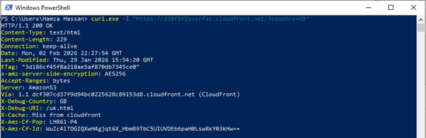

Key observations:
- `X-Debug-Country` confirms country detection
- `X-Debug-URI` confirms URI rewriting
- `X-Cache` indicates CloudFront cache behaviour (HIT / MISS)

### Geo-Personalised Content (Browser)

The browser output below demonstrates that the correct region-specific content is served to the client.

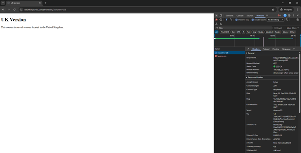

**Incognito Mode** 

## Project Status

✅ Architectures implemented
✅ Functional validation complete
✅ Full performance evaluation completed
✅ Results analysed and documented

## Final Conclusion

This project demonstrates that:

+ Edge computing improves performance only under the right conditions
+ Caching is the primary driver of latency reduction
+ Regional Lambda remains valuable for:
    + Debugging
    + Observability
    + Simpler workloads

Architectural decisions should be based on:

workload characteristics — not assumptions about edge performance

## Final note

This repository supports the Interim Progression Demonstration (IPD) and represents a stable foundation for the final evaluation of serverless and edge computing trade-offs.

## References & Bibliography

[References](https://github.com/HamzaHassan21/lambda-vs-lambdaedge-performance-analysis/blob/main/References.md)

[Bibliography](https://github.com/HamzaHassan21/lambda-vs-lambdaedge-performance-analysis/blob/main/Biliography.md)

## IPD Presentation Video (YouTube)

The recorded IPD presentation and accompanying architectural evaluation video are available below:

📺 [Benchmarking AWS Lambda vs Lambda@Edge](https://www.youtube.com/watch?v=p4h4Zpi5DbU&t=399s)

📺 [Architectural Evaluation](https://www.youtube.com/watch?v=EbT6csezZUM&t=203s)

## Author Hamza Hassan - Final-Year Computer Science Student, Cloud & DevOps Enthusiast

## 📫 Connect with Me
[LinkedIn](https://www.linkedin.com/in/hamzahassan21/)
[Youtube](https://www.youtube.com/channel/UC51JEAEBV8WXwf2ZLROvUJw)

